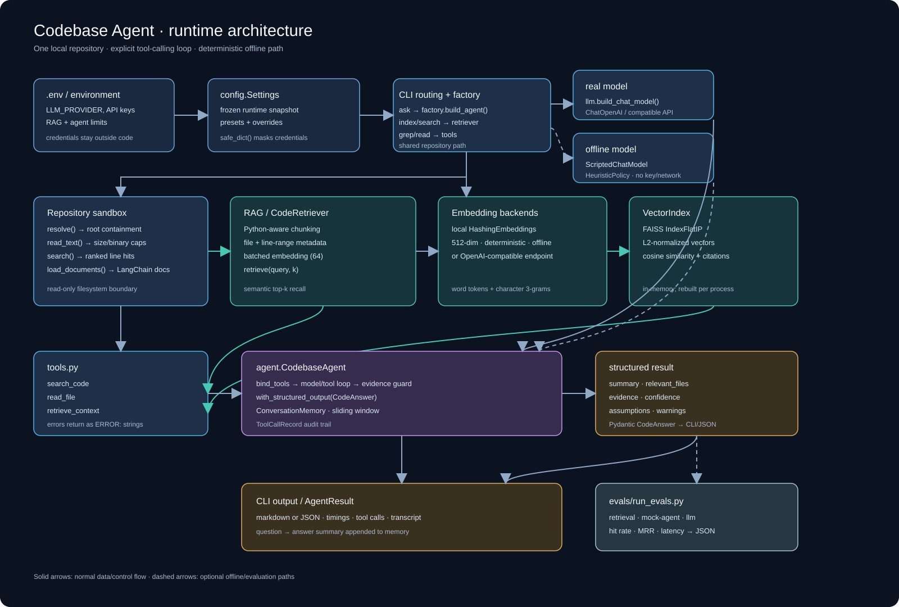
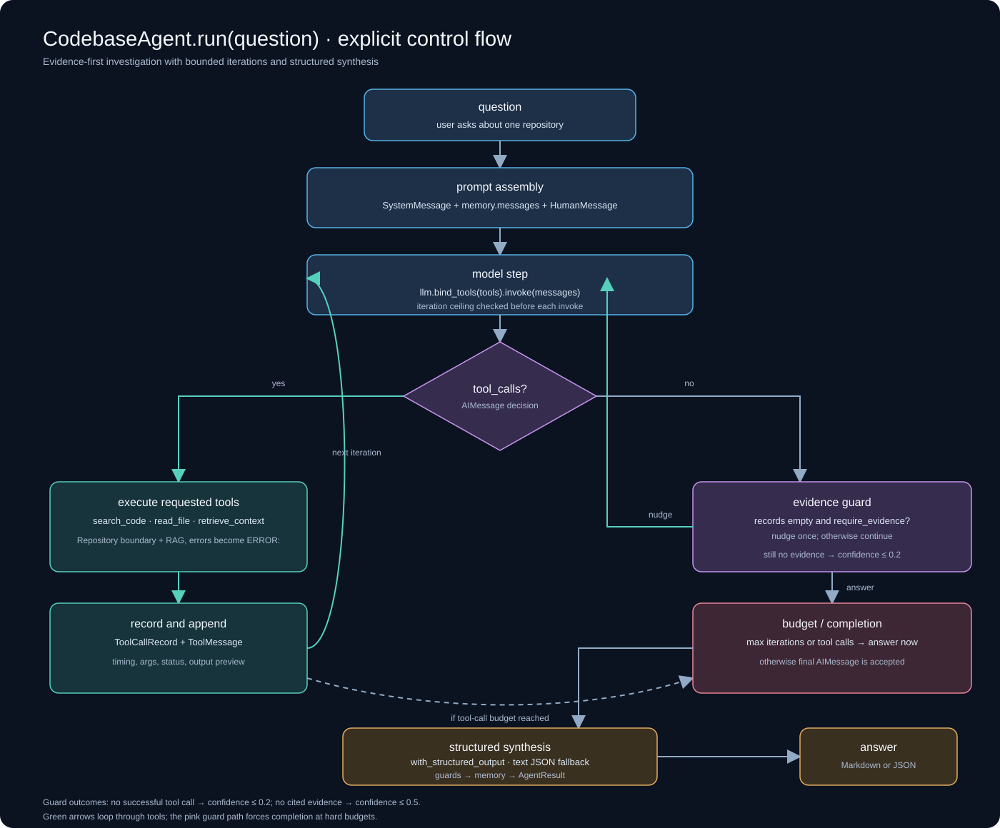
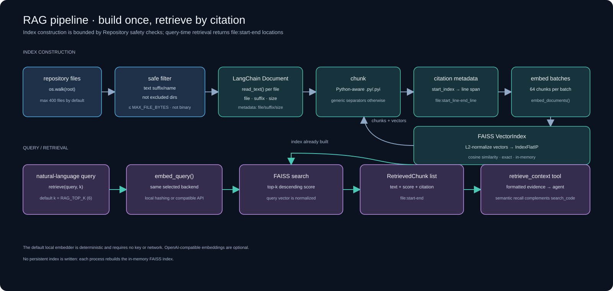
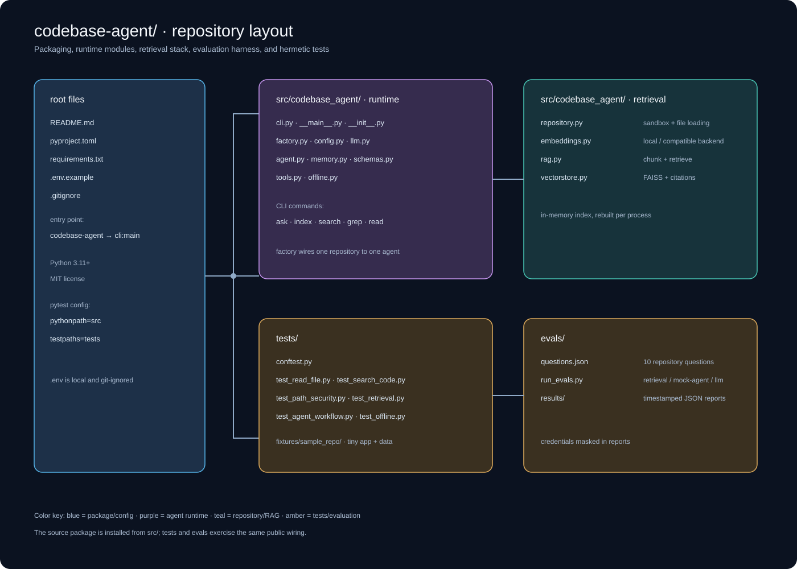
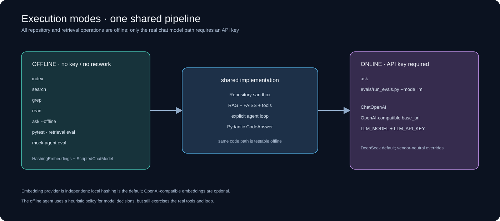
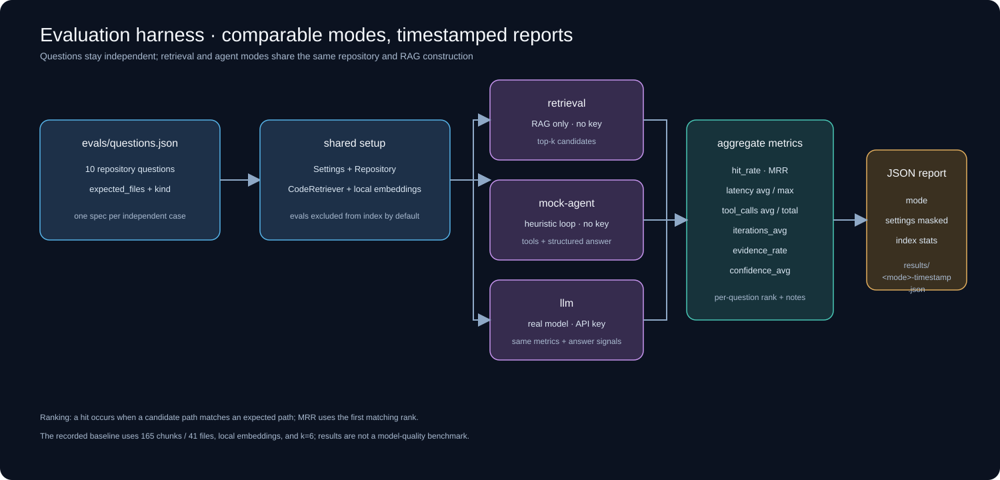

# codebase-agent

[](https://github.com/unravel1020/codebase-agent/actions/workflows/ci.yml)

An LLM agent that answers questions about a **local code repository** — with tool
calling, RAG retrieval, conversation memory, Pydantic structured output and an
evaluation harness. Built as a small, readable reference for modern AI
application engineering (not an enterprise platform).

* Default provider: **DeepSeek** (`deepseek-chat`), via any **OpenAI-compatible** endpoint.
* No hard-coded secrets: everything comes from `.env` / environment variables.
* Everything except the real LLM call runs **offline** — the test suite, the
  retrieval eval and a full agent-loop demo need **no API key**.

```bash
pip install -r requirements.txt
python -m codebase_agent ask --repo . "How does the path sandbox work?"
```

<details>
<summary>中文速览</summary>

* **做什么**：给一个本地代码仓库路径，用 LLM + 工具调用 + RAG 回答关于代码的问题，并输出结构化结果（summary / relevant_files / evidence / confidence）。
* **默认模型**：DeepSeek（`deepseek-chat`），但只依赖 OpenAI-compatible 接口，`LLM_BASE_URL` + `LLM_MODEL` 可换任何厂商。
* **离线可跑**：pytest 112 通过、retrieval eval、`ask --offline` 全流程都不需要 API key。
* **不需要 key 的命令**：`index` / `search` / `grep` / `read` / `ask --offline`。
* **需要 key 的**：`ask`（真实 LLM）、`evals/run_evals.py --mode llm`。
</details>

---

## Architecture



The runtime wires one sandboxed repository, an optional in-memory RAG index, three tools, and either a real compatible chat model or the offline scripted model into the explicit agent loop.

Module responsibilities (one job each):

| Module | Responsibility |
| --- | --- |
| `config.py` | Frozen `Settings` from `.env`/env; provider presets; key masking; `require_api_key()`. |
| `llm.py` | Builds `ChatOpenAI` for any OpenAI-compatible endpoint (base_url, model, timeout, retries). |
| `repository.py` | The sandbox: path resolution, traversal defence, size/binary limits, keyword search, RAG loading. |
| `tools.py` | The three LangChain `@tool`s the model may call; converts repo errors into `ERROR:` strings. |
| `embeddings.py` | `HashingEmbeddings` (offline, deterministic) + OpenAI-compatible embeddings. |
| `vectorstore.py` | FAISS `IndexFlatIP` wrapper with citation metadata. |
| `rag.py` | Chunking (Python-aware), batched embedding, top-k retrieval. |
| `memory.py` | Sliding-window conversation memory. |
| `schemas.py` | `CodeAnswer` / `EvidenceItem` Pydantic schemas + robust JSON extraction. |
| `agent.py` | The tool-calling loop, evidence guards, structured synthesis, audit trail. |
| `offline.py` | `ScriptedChatModel` + `HeuristicPolicy`: run the real loop with no API key. |
| `factory.py` | Wiring: path → repository → retriever → tools → agent. |
| `cli.py` | `ask` / `index` / `search` / `grep` / `read`. |

---

## Agent Loop

`CodebaseAgent.run(question)` (`src/codebase_agent/agent.py`):

1. **Prompt assembly** — `SystemMessage(rules)` + `memory.messages` (sliding window) + `HumanMessage(question)`.
2. **Model step** — `llm.bind_tools(tools).invoke(messages)`. The model returns either
   tool calls or a final message.
3. **Tool step** — every requested tool is executed through the LangChain tool
   interface, timed, recorded in a `ToolCallRecord`, and appended back as a
   `ToolMessage` (keyed by `tool_call_id`).
4. **Loop** — repeat until the model answers, `AGENT_MAX_ITERATIONS` is hit, or
   `AGENT_MAX_TOOL_CALLS` is reached (then the model is told to answer with what it has).
5. **Evidence guard** — if the model answered *without a single tool call* and
   `AGENT_REQUIRE_EVIDENCE=1`, the loop injects a nudge and runs once more. If it
   still has no evidence, confidence is clamped to ≤ 0.2 and a warning is added.
6. **Structured synthesis** — a separate call with
   `llm.with_structured_output(CodeAnswer, method=...)` turns the collected tool
   output into `summary / relevant_files / evidence / confidence`. If the endpoint
   does not support structured output, the response is parsed as JSON text, and
   `confidence` is capped at 0.5 when the answer cites no evidence.
7. **Memory** — the question and answer summary are appended to
   `ConversationMemory` for the next turn.

Properties that make it testable:

* The loop is ~60 lines of explicit control flow — no framework black box.
* `bind_tools` is the only model capability required, so `ScriptedChatModel`
  (a real `BaseChatModel` that replays tool-call decisions) exercises the exact
  production path offline.
* Every step leaves an audit trail (`AgentResult.to_dict()`): tool name, args,
  ok/error, per-call duration, iteration count, total latency.



The loop records every tool call, nudges once when evidence is missing, enforces iteration and tool-call budgets, then produces a guarded structured answer and updates memory.

---

## RAG Pipeline



Index construction is bounded by the repository sandbox; query-time retrieval returns top-k chunks with stable `file:start-end` citations.

* **Chunking** — `langchain_text_splitters.RecursiveCharacterTextSplitter`.
  `.py`/`.pyi` use `Language.PYTHON` separators (class/def boundaries first);
  everything else uses paragraph/line/word separators. `add_start_index=True` is
  converted into 1-based inclusive line ranges, so retrieved chunks can be cited
  as `file:start-end`.
* **Embeddings** — `EMBEDDING_PROVIDER=local` (default) is a deterministic
  feature-hashing model over word tokens + character 3-grams. It needs no key and
  no network, and works well for identifiers/keywords, which dominate code
  similarity. `EMBEDDING_PROVIDER=openai` switches to any OpenAI-compatible
  `/embeddings` endpoint (`check_embedding_ctx_length=False`, so non-OpenAI
  servers work too). DeepSeek has no public embeddings API, which is why the
  offline default keeps a DeepSeek-only setup fully runnable.
* **Vector store** — FAISS, chosen over Chroma because it is a single wheel with
  no server, no persistence layer and no telemetry: the simplest thing that gives
  real top-k search. `IndexFlatIP` is exact, which is fine for repository-scale
  corpora (this repo: ~165 chunks).
* **Retrieval as a tool** — `retrieve_context` is exposed to the model alongside
  `search_code`/`read_file`, so the agent decides when semantic recall beats
  exact symbol lookup.

---

## Project layout



The source package contains the runtime and retrieval layers; `evals/` benchmarks them and `tests/` exercises the same wiring against a fixture repository.

* `src/codebase_agent/` — the package: runtime, retrieval, tools, schemas and CLI.
* `tests/` — 113 tests plus `tests/fixtures/sample_repo/`, the tiny repository used by the suite, the offline demo and CI.
* `evals/` — `questions.json`, the harness, and generated `results/*.json` reports.
* `docs/images/*.svg` — the diagrams referenced from this README; `docs/summary/` — longer written walkthroughs.
* `.github/workflows/ci.yml` — the pipeline described under [Continuous integration](#continuous-integration).

---

## Install and run

Requires Python 3.11+ (developed on 3.14.5 / Windows, verified in CI on 3.11 and 3.14 / Linux).

```bash
cd codebase-agent
python -m venv .venv
.venv\Scripts\activate            # Windows
# source .venv/bin/activate       # macOS / Linux
pip install -r requirements.txt   # or: pip install -e ".[dev]"
copy .env.example .env            # then set LLM_API_KEY
```

### Configure the API key

The key lives in **`codebase-agent/.env`** (git-ignored, never committed). It is
read by `Settings.from_env()`; nothing is hard-coded and nothing is logged
(`Settings.safe_dict()` masks it as `***xxxx`).

```ini
# .env
LLM_PROVIDER=deepseek
LLM_API_KEY=sk-your-deepseek-key            # <-- the only line you must edit
# DEEPSEEK_API_KEY=sk-...                   # equivalent alternative
# LLM_BASE_URL=https://api.deepseek.com/v1  # optional override
# LLM_MODEL=deepseek-chat                   # optional override
```

Precedence: process environment > `.env` > built-in provider preset. So
`$env:LLM_API_KEY="sk-..."` (PowerShell) or `export LLM_API_KEY=...` also works
and wins over the file.

Then verify (a wrong key prints `401` advice, a wrong URL prints `404` advice —
never a traceback):

```bash
python -m codebase_agent ask --repo tests/fixtures/sample_repo "How are results persisted?"
python -m codebase_agent ask --repo . "How does the agent avoid answering without evidence?" --show-trace
python evals/run_evals.py --mode llm
```

Exit codes: `0` success · `2` configuration problem (missing key) · `3` provider
problem (401 / 404 / connection / rate limit) · `130` interrupted.

Commands (only `ask` without `--offline` needs a key):



All commands share the repository, tools, RAG, and structured-output implementation; only the real chat-model path requires an API key.

```bash
# index a repository and report chunk stats
python -m codebase_agent index --repo .

# symbol/keyword search, no LLM
python -m codebase_agent grep --repo . "CodebaseAgent" -n 10

# read a file with line numbers, no LLM
python -m codebase_agent read --repo . src/codebase_agent/agent.py --start 1 --end 40

# semantic retrieval (RAG) only, no LLM
python -m codebase_agent search --repo . "how is path traversal blocked" -k 5

# full agent loop, heuristic policy, NO API key
python -m codebase_agent ask --repo tests/fixtures/sample_repo "How are results persisted?" --offline --show-trace

# full agent loop with the real model (needs LLM_API_KEY)
python -m codebase_agent ask --repo . "How does the agent avoid answering without evidence?" --json
```

Example (offline, `tests/fixtures/sample_repo`):

```
$ python -m codebase_agent ask --repo tests/fixtures/sample_repo \
    "Where is the average of results computed and how is it persisted?" --offline --show-trace

Summary: The most relevant match ... is app/calculator.py:28 (`def average(values: list[float]) -> float:`).
Confidence: 0.55
Relevant files:
  - app/calculator.py
  ...
-- 2 tool call(s), 3 model iteration(s), 12 ms
   [1] search_code({'query': 'average results computed persisted'}) -> ok 5 ms
   [2] read_file({'path': 'app/calculator.py', 'start_line': 23, 'end_line': 73}) -> ok 1 ms
```

---

## Environment variables

Copy `.env.example` to `.env`. `LLM_BASE_URL` / `LLM_MODEL` always override the
provider preset, so any OpenAI-compatible vendor works.

| Variable | Default | Purpose |
| --- | --- | --- |
| `LLM_PROVIDER` | `deepseek` | Preset: `deepseek`, `openai`, `openai-compatible`. |
| `LLM_API_KEY` | – | Key for the chat model. Falls back to `DEEPSEEK_API_KEY` / `OPENAI_API_KEY`. Never logged (`safe_dict()` masks it). |
| `LLM_BASE_URL` | provider preset | e.g. `https://api.deepseek.com/v1`. |
| `LLM_MODEL` | provider preset | e.g. `deepseek-chat`. |
| `LLM_TEMPERATURE` | `0` | Keep deterministic for code answers. |
| `LLM_TIMEOUT` | `60` | Per-request timeout (seconds) passed to the client. |
| `LLM_MAX_RETRIES` | `2` | Client-level retries for transient errors. |
| `STRUCTURED_OUTPUT_METHOD` | `function_calling` | `function_calling` (widely supported) or `json_schema`. |
| `EMBEDDING_PROVIDER` | `local` | `local` = offline hashing embeddings, `openai` = compatible `/embeddings`. |
| `EMBEDDING_MODEL` | `text-embedding-3-small` | Used when `EMBEDDING_PROVIDER=openai`. |
| `EMBEDDING_BASE_URL` / `EMBEDDING_API_KEY` | – | Override the embedding endpoint/credential. |
| `EMBEDDING_DIM` | `512` | Dimension of the local hashing embeddings. |
| `RAG_TOP_K` | `6` | Retrieved chunks per `retrieve_context` call. |
| `RAG_CHUNK_SIZE` / `RAG_CHUNK_OVERLAP` | `1200` / `150` | Chunking parameters. |
| `RAG_MAX_INDEX_FILES` | `400` | Cap on files loaded into the index. |
| `MAX_FILE_BYTES` | `512000` | Files above this are never read or indexed. |
| `MAX_READ_LINES` | `400` | Line budget per `read_file` call. |
| `MAX_SEARCH_RESULTS` | `20` | Line budget per `search_code` call. |
| `AGENT_MAX_TOOL_CALLS` | `8` | Tool-call budget per question. |
| `AGENT_MAX_ITERATIONS` | `6` | Model turns per question. |
| `AGENT_MEMORY_TURNS` | `6` | Sliding-window size of the conversation memory. |
| `AGENT_REQUIRE_EVIDENCE` | `1` | `1` = nudge the model when it answers without tool calls. |
| `REPO_ROOT` | – | Default repository when `--repo` is omitted. |

---

## Testing

```bash
python -m pytest -q            # 112 passed, 1 skipped (Windows symlink test)
```

| Test module | Tests | Covers |
| --- | --- | --- |
| `test_read_file.py` | 12 | whole-file/window reads, line numbering, size + binary + directory rejection, tool error strings |
| `test_search_code.py` | 13 | definition ranking, line numbers, multi-token queries, `max_results`, regex mode, binary/excluded-dir skipping |
| `test_path_security.py` | 13 | `../` traversal (both separators), absolute paths outside root, NUL bytes, empty paths, symlink escape, tool-level blocking |
| `test_retrieval.py` | 15 | chunk metadata + line ranges, duplicate-block line accuracy, determinism, top-k relevance, score ordering, embedding similarity ordering, FAISS validation |
| `test_structured_output.py` | 13 | fenced/raw/prose JSON, invalid payloads, confidence bounds, file normalization, extra-key tolerance, JSON schema |
| `test_agent_workflow.py` | 14 | full tool-calling loop, evidence nudge, confidence clamps, tool budget, unknown tool, failing tool, structured-output fallback, memory across turns |
| `test_offline.py` | 7 | scripted model replay, heuristic policy state machine + reset, offline end-to-end |
| `test_memory.py` | 5 | sliding window, copy semantics, transcript |
| `test_config.py` | 11 | defaults (DeepSeek), presets, overrides, `.env` loading, key fallback, masking, bad values |
| `test_cli.py` | 10 | `index` / `grep` / `read` / `search` / `ask --offline` end-to-end, plus provider-error translation (401/connection) |

No test needs an API key or the network: an autouse fixture clears LLM/embedding
environment variables, and every model interaction goes through
`ScriptedChatModel`.

### Continuous integration

`.github/workflows/ci.yml` runs on every push to `main` and every pull request, on
Python **3.11** (the lower bound from `pyproject.toml`) and **3.14** (newest
release). Each job installs the dependencies, checks that the package imports,
runs the suite, exercises the offline agent demo, runs both offline evaluation
modes, writes a run summary with the metrics, and uploads the eval JSON as an
artifact. `faiss-cpu` ships an `abi3` wheel, so the same binary covers every
supported interpreter.

Everything in CI is API-key-free — the only mode that needs a key (`--mode llm`)
is deliberately left to manual runs.

---

## Evaluation

```bash
python evals/run_evals.py --mode retrieval      # RAG metrics only, no API key
python evals/run_evals.py --mode mock-agent     # full agent loop, offline
python evals/run_evals.py --mode llm            # real model, needs LLM_API_KEY
```



The evaluation harness runs independent questions through retrieval-only, offline mock-agent, or real-LLM modes, aggregates ranking and execution metrics, and writes masked timestamped JSON reports.

* Questions and expected files live in `evals/questions.json` (10 questions about
  this repository's own source).
* A hit means a returned candidate path equals, or ends with, an expected path.
* Reports are written to `evals/results/<mode>-<UTC timestamp>.json` with the
  full settings (credentials masked), index stats and per-question detail.

Metrics: `hit_rate`, `MRR`, `latency_ms_avg/max`, and for agent modes
`tool_calls_avg/total`, `iterations_avg`, `evidence_rate`, `confidence_avg`.

Recorded on 2026-09-10 against this repository (210 chunks / 42 files, offline
`local` embeddings, `k=6`). Reproduce with the two commands above:

| Mode | Hit rate | MRR | Latency (avg) | Tool calls (avg) | Evidence rate |
| --- | --- | --- | --- | --- | --- |
| `retrieval` | 5/10 = 50% | 0.633 | 0.1 ms | – | – |
| `mock-agent` | 4/10 = 40% | 0.667 | 70.4 ms | 2.00 | 100% |
| `llm` (deepseek-chat) | 10/10 = 100% | 1.000 | 7.5 s | 5.90 | 100% |

How to read these numbers:

* `llm` is the mode that matters: with a real model the agent reaches 10/10 with
  100% evidence rate, 5.9 tool calls and 0.914 average self-reported confidence —
  because it can *choose* `search_code` for symbol questions instead of relying on
  vector similarity alone.
* `retrieval` is the RAG-only baseline and it is deliberately unflattering. With
  lexical (hashing) embeddings, `README.md` — 20 KB of prose that describes every
  module in words — wins the top spot for 6 of the 10 questions, ahead of the
  source files it describes. The score also moved from 70% (165 chunks) to 50%
  (210 chunks) purely because the README grew; the chunker fix that landed in
  between provably emits identical chunk text (210 vs 210, zero differences), so
  it cannot affect this metric. This is a corpus/diagnostic effect, and the honest
  way to read it is: *the offline baseline is fragile against prose-heavy docs,
  and the agent's tool use is what absorbs that fragility.*
* `mock-agent` measures the **loop**, not model quality: the heuristic policy
  ranks files by keyword hits only, yet it reaches 100% evidence rate with 2 tool
  calls per question.
* The questions file is excluded from the index by default (`--exclude evals`) to
  avoid the questions matching themselves; this alone moved MRR from 0.488 to 0.798
  at the time it was introduced. Running the code-only corpus
  (`--exclude evals docs README.md`) restores 8/10 = 80% with MRR 0.729 (167 chunks
  / 38 files) — the same retriever, only the prose removed, which isolates the
  cause of the drop above.
* Every number here is reproducible on the current commit; if a corpus change
  moves them, update this table in the same commit rather than leaving stale
  figures behind.

---

## Design decisions

* **Explicit agent loop over LangGraph.** LangChain 1.x offers
  `langchain.agents.create_agent`, but this project's point is to *show* the loop.
  `bind_tools` + `ToolMessage` + a `while` is the whole agent; swapping in
  `create_agent` is a ~10-line change if you want the framework version.
* **DeepSeek by default, vendor-neutral by construction.** One `ChatOpenAI`
  instance with an explicit `base_url`; `LLM_PROVIDER`/`LLM_BASE_URL`/`LLM_MODEL`
  change vendor without touching code.
* **Local embeddings by default.** DeepSeek has no embeddings API; a deterministic
  offline embedder keeps `pytest`, the eval harness and `ask --offline` fully
  runnable with zero credentials and zero network.
* **Tool errors are strings, not exceptions.** A failing tool returns `ERROR: ...`
  so the loop can recover and stay within budget — and so a malicious model
  cannot crash the process by asking for a bad path.
* **Two-layer path defence.** `Repository.resolve()` is the only door to the
  filesystem: it resolves symlinks, then requires the result to be inside the
  root. Size, binary and directory checks happen before any read.
* **No chain-of-thought.** The structured schema asks for a short factual
  `evidence` note per item plus a confidence score — nothing hidden is requested
  or stored.

---

## Known limitations

1. **Lexical embeddings by default.** The offline hashing embedder has no semantic
   generalization; paraphrase questions miss (see the eval above). It is also
   easily swamped by large prose documents: `README.md` outranks the source files
   it describes for 6 of the 10 questions, which is why the retrieval baseline sits
   at 50%. Set `EMBEDDING_PROVIDER=openai` with a real embedding model, or let the
   agent use `search_code` instead of vector search, for better recall.
2. **`search_code` re-reads files on every call.** Fine for repos up to a few
   hundred files; a large monorepo would want a cached content pass or an
   incremental index. There is also no cross-file symbol index (e.g. "who calls
   this function").
3. **No index persistence.** The FAISS index is rebuilt on every process start
   (fast here: <0.1 s for 41 files). `faiss.write_index` would be the next step.
4. **Memory is a plain sliding window.** No summarization, no per-file memory, no
   retrieval over past turns; long sessions lose early context by design.
5. **One repository per agent, one question at a time.** No multi-agent routing,
   no concurrent tool execution (`parallel_tool_calls` is left to the provider).
6. **Evaluation is small and self-referential.** 10 questions about this repo, one
   expected file each; hit rate is file-level, not answer-level. There is no LLM
   judge and no regression baseline stored in CI.
7. **Structured output depends on the endpoint.** `function_calling` is the
   default because it is the most widely supported mode; providers that support
   neither function calling nor JSON schema fall back to text parsing (with a
   warning in `warnings`).
8. **Symlink escape test is skipped on Windows** unless the process can create
   symlinks (Developer Mode / admin). The check itself is still exercised by the
   `resolve()` tests.
9. **No secrets management beyond env vars.** Fine for local use; a deployed
   version should use a secret manager, and `safe_dict()` only masks, it does not
   encrypt.
10. **Python 3.11+ only.** Verified on 3.14.5; `faiss-cpu`, `langchain-core`,
    `langchain-openai` and `pytest` all resolve to prebuilt wheels there.

## TODO

* [ ] Persist the FAISS index (`save`/`load`) and add an incremental rebuild.
* [ ] Optional `langchain.agents.create_agent` runner behind a flag, to compare
      the explicit loop against the framework agent.
* [ ] Cross-file symbol index for "where is X called" questions.
* [ ] LLM-as-judge scoring in `evals/`, plus a stored baseline to diff against.
* [ ] Streaming output in the CLI, and a `--no-retrieval` mode for pure tool use.

## Further reading

* [从 `bind_tools` 到 `ToolMessage`：Agent 的 Tool Calling 到底是怎么运行的？](docs/summary/tool-calling.md)
  — a walkthrough of the tool-calling path in this project: how tools are bound,
  what the model actually returns, how `ToolMessage` closes the loop, and how the
  audit trail is recorded.

## License

MIT.
